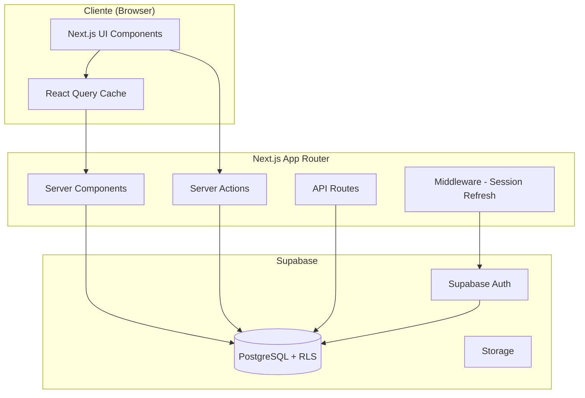

# Documento de Diseño - Sistema de Gestión de Inventario

## Overview

Este documento describe el diseño técnico para un sistema web de gestión de inventario construido con Next.js 14 (App Router), Supabase (PostgreSQL + Auth), y TypeScript. El sistema permite a usuarios autenticados gestionar productos, rastrear movimientos de stock, y calcular valores de inventario en tiempo real.

**Decisiones Técnicas Clave:**

- **Frontend**: Next.js 14 con App Router para aprovechar Server Components y Server Actions
- **Backend**: Supabase como Backend-as-a-Service (PostgreSQL + Auth + Storage)
- **Autenticación**: Supabase Auth con JWT almacenados en cookies HTTP-only
- **Seguridad**: Row Level Security (RLS) de PostgreSQL para control de acceso a nivel de fila
- **Estado**: React Query para caché del lado del cliente y sincronización con servidor
- **Lenguaje**: TypeScript para type safety en frontend y backend

**Fuentes de Investigación:**
- [Supabase Authentication with Next.js](https://designrevision.com/blog/supabase-auth-nextjs) - Patrones de autenticación con JWT y cookies
- [Row Level Security in Supabase](https://www.supabase.com/docs/guides/database/postgres/row-level-security) - Implementación de políticas RLS
- [Next.js 14 with Supabase](https://www.6dotsdc.com/blog/supabase-nextjs-authentication-guide) - Integración de Server Components y middleware

## Architecture

### Arquitectura de Alto Nivel



### Flujo de Autenticación

1. Usuario envía credenciales a través de Server Action
2. Server Action llama a Supabase Auth
3. Supabase Auth valida credenciales y retorna JWT
4. JWT se almacena en cookie HTTP-only
5. Middleware de Next.js refresca sesión en cada request
6. RLS policies en PostgreSQL validan acceso usando JWT

### Separación de Responsabilidades

- **Server Components**: Renderizado inicial, fetching de datos
- **Client Components**: Interactividad, formularios, UI dinámica
- **Server Actions**: Mutaciones de datos (crear, actualizar, eliminar)
- **Middleware**: Gestión de sesiones, protección de rutas
- **RLS Policies**: Autorización a nivel de base de datos

## Components and Interfaces

### Estructura de Componentes

```
app/
├── (auth)/
│   ├── login/
│   │   └── page.tsx          # Página de login
│   └── layout.tsx             # Layout sin autenticación
├── (dashboard)/
│   ├── layout.tsx             # Layout con autenticación
│   ├── page.tsx               # Dashboard principal
│   ├── products/
│   │   ├── page.tsx           # Lista de productos
│   │   ├── [id]/
│   │   │   └── page.tsx       # Detalle de producto
│   │   └── new/
│   │       └── page.tsx       # Crear producto
│   └── reports/
│       └── page.tsx           # Reportes de movimientos
├── middleware.ts              # Session refresh
└── actions/
    ├── auth.ts                # Server actions de autenticación
    ├── products.ts            # Server actions de productos
    └── stock.ts               # Server actions de stock
```

### Componentes Principales

#### 1. Authentication Components

**LoginForm** (Client Component)
```typescript
interface LoginFormProps {
  onSuccess?: () => void;
}
```
- Maneja input de credenciales
- Llama a Server Action `signIn`
- Muestra errores de validación

**AuthProvider** (Client Component)
```typescript
interface AuthContextValue {
  user: User | null;
  loading: boolean;
  signOut: () => Promise<void>;
}
```
- Provee contexto de usuario autenticado
- Gestiona estado de sesión

#### 2. Product Management Components

**ProductList** (Server Component)
```typescript
interface ProductListProps {
  searchQuery?: string;
  sortBy?: 'code' | 'name' | 'price';
}
```
- Renderiza lista de productos desde DB
- Muestra código, nombre, precio, stock, valor

**ProductForm** (Client Component)
```typescript
interface ProductFormProps {
  product?: Product;
  onSubmit: (data: ProductFormData) => Promise<void>;
}

interface ProductFormData {
  code: string;
  name: string;
  description: string;
  price: number;
}
```
- Formulario para crear/editar productos
- Validación del lado del cliente
- Llama a Server Actions

**ProductCard** (Client Component)
```typescript
interface ProductCardProps {
  product: Product;
  onEdit?: () => void;
  onDelete?: () => void;
}
```
- Muestra información de producto individual
- Acciones rápidas (editar, eliminar)

#### 3. Stock Management Components

**StockMovementForm** (Client Component)
```typescript
interface StockMovementFormProps {
  productId: string;
  currentStock: number;
  onSubmit: (data: StockMovementData) => Promise<void>;
}

interface StockMovementData {
  type: 'in' | 'out';
  quantity: number;
  notes?: string;
}
```
- Registra entradas/salidas de stock
- Validación de cantidad negativa
- Actualización optimista con React Query

**StockHistory** (Server Component)
```typescript
interface StockHistoryProps {
  productId: string;
  dateRange?: { from: Date; to: Date };
}
```
- Muestra historial de movimientos
- Filtrado por rango de fechas
- Exportación a CSV

#### 4. Inventory Dashboard Components

**InventoryValueCard** (Server Component)
```typescript
interface InventoryValueCardProps {
  refreshInterval?: number;
}
```
- Calcula y muestra valor total de inventario
- Actualización en tiempo real

**InventoryTable** (Server Component)
```typescript
interface InventoryTableProps {
  filters?: InventoryFilters;
  pagination?: PaginationParams;
}
```
- Tabla completa de inventario
- Búsqueda y filtrado
- Paginación server-side

### Server Actions

#### Authentication Actions

```typescript
// app/actions/auth.ts
export async function signIn(
  email: string,
  password: string
): Promise<{ success: boolean; error?: string }>;

export async function signOut(): Promise<void>;

export async function getSession(): Promise<Session | null>;
```

#### Product Actions

```typescript
// app/actions/products.ts
export async function createProduct(
  data: ProductFormData
): Promise<{ success: boolean; product?: Product; error?: string }>;

export async function updateProduct(
  id: string,
  data: Partial<ProductFormData>
): Promise<{ success: boolean; product?: Product; error?: string }>;

export async function deleteProduct(
  id: string
): Promise<{ success: boolean; error?: string }>;

export async function getProducts(
  filters?: ProductFilters
): Promise<Product[]>;

export async function getProductById(
  id: string
): Promise<Product | null>;
```

#### Stock Actions

```typescript
// app/actions/stock.ts
export async function recordStockMovement(
  productId: string,
  data: StockMovementData
): Promise<{ success: boolean; movement?: StockMovement; error?: string }>;

export async function getStockHistory(
  productId: string,
  filters?: StockHistoryFilters
): Promise<StockMovement[]>;

export async function exportStockHistory(
  productId: string,
  filters?: StockHistoryFilters
): Promise<Blob>;
```

## Data Models

### Database Schema

```sql
-- Tabla de productos
CREATE TABLE products (
  id UUID PRIMARY KEY DEFAULT gen_random_uuid(),
  code VARCHAR(50) UNIQUE NOT NULL,
  name VARCHAR(255) NOT NULL,
  description TEXT,
  price DECIMAL(10, 2) NOT NULL CHECK (price > 0),
  current_stock INTEGER NOT NULL DEFAULT 0 CHECK (current_stock >= 0),
  user_id UUID NOT NULL REFERENCES auth.users(id) ON DELETE CASCADE,
  created_at TIMESTAMPTZ NOT NULL DEFAULT NOW(),
  updated_at TIMESTAMPTZ NOT NULL DEFAULT NOW()
);

-- Tabla de movimientos de stock
CREATE TABLE stock_movements (
  id UUID PRIMARY KEY DEFAULT gen_random_uuid(),
  product_id UUID NOT NULL REFERENCES products(id) ON DELETE CASCADE,
  type VARCHAR(10) NOT NULL CHECK (type IN ('in', 'out')),
  quantity INTEGER NOT NULL CHECK (quantity > 0),
  stock_after INTEGER NOT NULL CHECK (stock_after >= 0),
  notes TEXT,
  user_id UUID NOT NULL REFERENCES auth.users(id),
  created_at TIMESTAMPTZ NOT NULL DEFAULT NOW()
);

-- Índices para optimización
CREATE INDEX idx_products_user_id ON products(user_id);
CREATE INDEX idx_products_code ON products(code);
CREATE INDEX idx_stock_movements_product_id ON stock_movements(product_id);
CREATE INDEX idx_stock_movements_created_at ON stock_movements(created_at DESC);

-- Trigger para actualizar updated_at
CREATE OR REPLACE FUNCTION update_updated_at_column()
RETURNS TRIGGER AS $$
BEGIN
  NEW.updated_at = NOW();
  RETURN NEW;
END;
$$ LANGUAGE plpgsql;

CREATE TRIGGER update_products_updated_at
  BEFORE UPDATE ON products
  FOR EACH ROW
  EXECUTE FUNCTION update_updated_at_column();
```

### Row Level Security Policies

```sql
-- Habilitar RLS en todas las tablas
ALTER TABLE products ENABLE ROW LEVEL SECURITY;
ALTER TABLE stock_movements ENABLE ROW LEVEL SECURITY;

-- Políticas para products
CREATE POLICY "Users can view their own products"
  ON products FOR SELECT
  USING (auth.uid() = user_id);

CREATE POLICY "Users can insert their own products"
  ON products FOR INSERT
  WITH CHECK (auth.uid() = user_id);

CREATE POLICY "Users can update their own products"
  ON products FOR UPDATE
  USING (auth.uid() = user_id)
  WITH CHECK (auth.uid() = user_id);

CREATE POLICY "Users can delete their own products"
  ON products FOR DELETE
  USING (auth.uid() = user_id);

-- Políticas para stock_movements
CREATE POLICY "Users can view movements of their products"
  ON stock_movements FOR SELECT
  USING (
    EXISTS (
      SELECT 1 FROM products
      WHERE products.id = stock_movements.product_id
      AND products.user_id = auth.uid()
    )
  );

CREATE POLICY "Users can insert movements for their products"
  ON stock_movements FOR INSERT
  WITH CHECK (
    auth.uid() = user_id AND
    EXISTS (
      SELECT 1 FROM products
      WHERE products.id = stock_movements.product_id
      AND products.user_id = auth.uid()
    )
  );
```

### TypeScript Types

```typescript
// types/database.ts
export interface Product {
  id: string;
  code: string;
  name: string;
  description: string | null;
  price: number;
  current_stock: number;
  user_id: string;
  created_at: string;
  updated_at: string;
}

export interface StockMovement {
  id: string;
  product_id: string;
  type: 'in' | 'out';
  quantity: number;
  stock_after: number;
  notes: string | null;
  user_id: string;
  created_at: string;
}

export interface ProductWithValue extends Product {
  inventory_value: number;
}

// types/forms.ts
export interface ProductFormData {
  code: string;
  name: string;
  description?: string;
  price: number;
}

export interface StockMovementData {
  type: 'in' | 'out';
  quantity: number;
  notes?: string;
}

// types/filters.ts
export interface ProductFilters {
  search?: string;
  sortBy?: 'code' | 'name' | 'price' | 'stock';
  sortOrder?: 'asc' | 'desc';
}

export interface StockHistoryFilters {
  dateFrom?: Date;
  dateTo?: Date;
  type?: 'in' | 'out';
}
```

### Validation Schemas

```typescript
// lib/validations.ts
import { z } from 'zod';

export const productSchema = z.object({
  code: z.string()
    .min(1, 'El código es requerido')
    .regex(/^[a-zA-Z0-9-]+$/, 'El código solo puede contener letras, números y guiones'),
  name: z.string()
    .min(1, 'El nombre es requerido')
    .max(255, 'El nombre no puede exceder 255 caracteres'),
  description: z.string().optional(),
  price: z.number()
    .positive('El precio debe ser mayor a 0')
});

export const stockMovementSchema = z.object({
  type: z.enum(['in', 'out']),
  quantity: z.number()
    .int('La cantidad debe ser un número entero')
    .positive('La cantidad debe ser mayor a 0'),
  notes: z.string().optional()
});

export const loginSchema = z.object({
  email: z.string().email('Email inválido'),
  password: z.string().min(6, 'La contraseña debe tener al menos 6 caracteres')
});
```


## Correctness Properties

*Una propiedad es una característica o comportamiento que debe ser verdadero en todas las ejecuciones válidas de un sistema - esencialmente, una declaración formal sobre lo que el sistema debe hacer. Las propiedades sirven como puente entre especificaciones legibles por humanos y garantías de corrección verificables por máquinas.*

### Property 1: Product Round-Trip Persistence

*Para cualquier* producto válido con código, nombre, descripción y precio, crear el producto y luego recuperarlo de la base de datos debe retornar los mismos valores para todos los campos.

**Validates: Requirements 2.2, 7.1**

### Property 2: Unique Product Code Enforcement

*Para cualquier* conjunto de productos, el sistema debe garantizar que:
- Al crear un producto, se le asigna un código único que no existe en la base de datos
- Intentar crear un producto con un código duplicado debe fallar con un error
- Intentar actualizar un producto para usar el código de otro producto existente debe fallar con un error

**Validates: Requirements 2.1, 2.3, 2.4**

### Property 3: Cascade Deletion

*Para cualquier* producto con movimientos de stock asociados, eliminar el producto debe también eliminar todos sus movimientos de stock, de modo que ni el producto ni sus movimientos sean recuperables después de la eliminación.

**Validates: Requirements 2.5**

### Property 4: Stock Movement Updates Stock Correctly

*Para cualquier* producto con stock inicial S y cantidad Q > 0:
- Registrar un movimiento de entrada ('in') con cantidad Q debe resultar en stock final de S + Q
- Registrar un movimiento de salida ('out') con cantidad Q (donde Q ≤ S) debe resultar en stock final de S - Q

**Validates: Requirements 3.2, 3.3**

### Property 5: Negative Stock Prevention

*Para cualquier* producto con stock actual S, intentar registrar un movimiento de salida con cantidad Q donde Q > S debe ser rechazado con un error, y el stock del producto debe permanecer sin cambios.

**Validates: Requirements 3.4**

### Property 6: Movement Persistence with Required Fields

*Para cualquier* movimiento de stock registrado, el movimiento debe:
- Ser persistido en la base de datos y recuperable
- Contener todos los campos requeridos: tipo ('in' o 'out'), cantidad, stock_after, user_id, created_at
- Tener un timestamp created_at que refleje el momento de creación
- Tener un stock_after que refleje el stock del producto después del movimiento

**Validates: Requirements 3.5, 4.5, 7.2, 7.3, 9.1, 9.4**

### Property 7: Inventory Value Calculation Per Product

*Para cualquier* producto con precio P y stock actual S, el valor de inventario calculado debe ser exactamente P × S.

**Validates: Requirements 4.2**

### Property 8: Total Inventory Value Calculation

*Para cualquier* conjunto de productos en el inventario, el valor total de inventario debe ser igual a la suma de (precio × stock) para todos los productos, incluyendo productos con stock cero que contribuyen valor cero.

**Validates: Requirements 5.1, 5.4**

### Property 9: Search Filtering Correctness

*Para cualquier* consulta de búsqueda Q, todos los productos retornados deben tener su código o nombre conteniendo Q (case-insensitive), y ningún producto que coincida con Q debe ser excluido de los resultados.

**Validates: Requirements 4.3**

### Property 10: Product List Default Sorting

*Para cualquier* lista de productos retornada sin especificar orden de clasificación, los productos deben estar ordenados por código de producto en orden ascendente.

**Validates: Requirements 4.4**

### Property 11: Movement History Sorting

*Para cualquier* producto, al solicitar su historial de movimientos, los movimientos deben estar ordenados por fecha de creación en orden descendente (más reciente primero).

**Validates: Requirements 9.2**

### Property 12: Date Range Filtering

*Para cualquier* rango de fechas [fecha_inicio, fecha_fin], todos los movimientos retornados deben tener created_at dentro de ese rango (inclusive), y ningún movimiento dentro del rango debe ser excluido.

**Validates: Requirements 9.3**

### Property 13: CSV Export Completeness

*Para cualquier* conjunto de movimientos filtrados, exportar a CSV debe producir un archivo que contiene exactamente todos los movimientos del conjunto, con todas las columnas requeridas (tipo, cantidad, stock_after, fecha, usuario) en formato CSV válido.

**Validates: Requirements 9.5**

### Property 14: Product Validation Rules

*Para cualquier* intento de crear o actualizar un producto, el sistema debe validar que:
- El nombre no esté vacío ni sea solo espacios en blanco (debe rechazar strings vacíos o whitespace-only)
- El precio sea un número positivo (debe rechazar valores ≤ 0)
- El código contenga solo caracteres alfanuméricos y guiones (debe rechazar códigos con caracteres especiales)
- Si alguna validación falla, el error debe especificar qué campo(s) fallaron y por qué

**Validates: Requirements 6.1, 6.2, 6.3, 6.4**

## Error Handling

### Error Categories

#### 1. Validation Errors (400 Bad Request)

```typescript
interface ValidationError {
  type: 'validation_error';
  message: string;
  fields: {
    [fieldName: string]: string[];
  };
}
```

**Ejemplos:**
- Código de producto duplicado
- Nombre vacío
- Precio negativo o cero
- Código con caracteres inválidos
- Cantidad de stock negativa

**Manejo:**
- Validación en el cliente con Zod antes de enviar
- Validación en Server Actions antes de DB
- Retornar errores específicos por campo
- Mostrar errores inline en formularios

#### 2. Business Logic Errors (422 Unprocessable Entity)

```typescript
interface BusinessError {
  type: 'business_error';
  message: string;
  code: string;
}
```

**Ejemplos:**
- Intentar sacar más stock del disponible
- Eliminar producto que no existe
- Actualizar producto sin permisos

**Manejo:**
- Validación en Server Actions
- Retornar mensaje descriptivo
- Mostrar toast/notification al usuario

#### 3. Authentication Errors (401 Unauthorized)

```typescript
interface AuthError {
  type: 'auth_error';
  message: string;
  code: 'invalid_credentials' | 'session_expired' | 'no_session';
}
```

**Ejemplos:**
- Credenciales inválidas
- Sesión expirada
- Token JWT inválido

**Manejo:**
- Middleware detecta sesión inválida
- Redirigir a página de login
- Mostrar mensaje de error en login form

#### 4. Authorization Errors (403 Forbidden)

```typescript
interface AuthorizationError {
  type: 'authorization_error';
  message: string;
}
```

**Ejemplos:**
- Intentar acceder a productos de otro usuario
- RLS policy rechaza operación

**Manejo:**
- RLS policies en PostgreSQL
- Retornar 403 desde Server Actions
- Mostrar mensaje "No tienes permisos"

#### 5. Database Errors (500 Internal Server Error)

```typescript
interface DatabaseError {
  type: 'database_error';
  message: string;
  retryable: boolean;
}
```

**Ejemplos:**
- Error de conexión a Supabase
- Timeout de query
- Constraint violation no manejada

**Manejo:**
- Retry automático para errores transitorios (3 intentos)
- Logging detallado en servidor
- Mensaje genérico al usuario
- Fallback a caché si disponible

### Error Handling Patterns

#### Server Actions Error Handling

```typescript
export async function createProduct(data: ProductFormData) {
  try {
    // 1. Validación de entrada
    const validated = productSchema.parse(data);
    
    // 2. Obtener sesión
    const session = await getSession();
    if (!session) {
      return { 
        success: false, 
        error: { type: 'auth_error', message: 'No autenticado' } 
      };
    }
    
    // 3. Operación de DB con retry
    const product = await withRetry(async () => {
      const { data, error } = await supabase
        .from('products')
        .insert({ ...validated, user_id: session.user.id })
        .select()
        .single();
      
      if (error) throw error;
      return data;
    });
    
    return { success: true, product };
    
  } catch (error) {
    if (error instanceof z.ZodError) {
      return {
        success: false,
        error: {
          type: 'validation_error',
          message: 'Datos inválidos',
          fields: formatZodErrors(error)
        }
      };
    }
    
    if (error.code === '23505') { // Unique constraint violation
      return {
        success: false,
        error: {
          type: 'business_error',
          message: 'El código de producto ya existe',
          code: 'duplicate_code'
        }
      };
    }
    
    // Error genérico
    console.error('Error creating product:', error);
    return {
      success: false,
      error: {
        type: 'database_error',
        message: 'Error al crear producto. Intenta nuevamente.',
        retryable: true
      }
    };
  }
}
```

#### Client-Side Error Display

```typescript
// components/ProductForm.tsx
const handleSubmit = async (data: ProductFormData) => {
  const result = await createProduct(data);
  
  if (!result.success) {
    const error = result.error;
    
    switch (error.type) {
      case 'validation_error':
        // Mostrar errores por campo
        Object.entries(error.fields).forEach(([field, messages]) => {
          form.setError(field, { message: messages[0] });
        });
        break;
        
      case 'business_error':
        // Toast de error
        toast.error(error.message);
        break;
        
      case 'auth_error':
        // Redirigir a login
        router.push('/login');
        break;
        
      case 'database_error':
        // Toast con opción de retry
        toast.error(error.message, {
          action: error.retryable ? {
            label: 'Reintentar',
            onClick: () => handleSubmit(data)
          } : undefined
        });
        break;
    }
  } else {
    toast.success('Producto creado exitosamente');
    router.push('/products');
  }
};
```

### Retry Logic

```typescript
// lib/retry.ts
export async function withRetry<T>(
  fn: () => Promise<T>,
  options = { maxAttempts: 3, delayMs: 1000 }
): Promise<T> {
  let lastError: Error;
  
  for (let attempt = 1; attempt <= options.maxAttempts; attempt++) {
    try {
      return await fn();
    } catch (error) {
      lastError = error;
      
      // No reintentar errores de validación o autenticación
      if (
        error.code === '23505' || // Unique violation
        error.code === 'PGRST301' || // Auth error
        error.status === 401 ||
        error.status === 403
      ) {
        throw error;
      }
      
      // Esperar antes de reintentar
      if (attempt < options.maxAttempts) {
        await new Promise(resolve => 
          setTimeout(resolve, options.delayMs * attempt)
        );
      }
    }
  }
  
  throw lastError;
}
```

## Testing Strategy

### Testing Approach Overview

Este proyecto utilizará una estrategia de testing dual que combina:

1. **Property-Based Testing (PBT)**: Para validar propiedades universales de la lógica de negocio
2. **Example-Based Unit Tests**: Para casos específicos, edge cases, y ejemplos concretos
3. **Integration Tests**: Para verificar integración con Supabase, autenticación, y flujos end-to-end

### Property-Based Testing

**Librería**: [fast-check](https://github.com/dubzzz/fast-check) para TypeScript

**Configuración**:
- Mínimo 100 iteraciones por property test
- Cada test debe referenciar la propiedad del documento de diseño
- Tag format: `Feature: inventory-management-system, Property {number}: {property_text}`

**Áreas de Aplicación**:

#### 1. Product Management Logic

```typescript
// __tests__/properties/products.test.ts
import fc from 'fast-check';

describe('Product Management Properties', () => {
  // Feature: inventory-management-system, Property 1: Product Round-Trip Persistence
  it('should preserve all product fields after create and retrieve', async () => {
    await fc.assert(
      fc.asyncProperty(
        productArbitrary(),
        async (productData) => {
          const created = await createProduct(productData);
          const retrieved = await getProductById(created.id);
          
          expect(retrieved.code).toBe(productData.code);
          expect(retrieved.name).toBe(productData.name);
          expect(retrieved.description).toBe(productData.description);
          expect(retrieved.price).toBe(productData.price);
        }
      ),
      { numRuns: 100 }
    );
  });
  
  // Feature: inventory-management-system, Property 2: Unique Product Code Enforcement
  it('should reject duplicate product codes', async () => {
    await fc.assert(
      fc.asyncProperty(
        productArbitrary(),
        async (productData) => {
          await createProduct(productData);
          const result = await createProduct(productData);
          
          expect(result.success).toBe(false);
          expect(result.error?.code).toBe('duplicate_code');
        }
      ),
      { numRuns: 100 }
    );
  });
  
  // Feature: inventory-management-system, Property 14: Product Validation Rules
  it('should reject products with invalid data', async () => {
    await fc.assert(
      fc.asyncProperty(
        fc.record({
          code: fc.string().filter(s => !/^[a-zA-Z0-9-]+$/.test(s)),
          name: fc.constantFrom('', '   ', '\t\n'),
          price: fc.oneof(fc.constant(0), fc.double({ max: 0 }))
        }),
        async (invalidData) => {
          const result = await createProduct(invalidData);
          
          expect(result.success).toBe(false);
          expect(result.error?.type).toBe('validation_error');
        }
      ),
      { numRuns: 100 }
    );
  });
});
```

#### 2. Stock Movement Logic

```typescript
// __tests__/properties/stock.test.ts
describe('Stock Movement Properties', () => {
  // Feature: inventory-management-system, Property 4: Stock Movement Updates Stock Correctly
  it('should update stock correctly for in/out movements', async () => {
    await fc.assert(
      fc.asyncProperty(
        fc.record({
          initialStock: fc.nat(1000),
          quantity: fc.nat(100),
          type: fc.constantFrom('in', 'out')
        }),
        async ({ initialStock, quantity, type }) => {
          const product = await createProductWithStock(initialStock);
          
          if (type === 'out' && quantity > initialStock) {
            // Skip invalid case (covered by Property 5)
            return;
          }
          
          await recordStockMovement(product.id, { type, quantity });
          const updated = await getProductById(product.id);
          
          const expectedStock = type === 'in' 
            ? initialStock + quantity 
            : initialStock - quantity;
          
          expect(updated.current_stock).toBe(expectedStock);
        }
      ),
      { numRuns: 100 }
    );
  });
  
  // Feature: inventory-management-system, Property 5: Negative Stock Prevention
  it('should prevent negative stock', async () => {
    await fc.assert(
      fc.asyncProperty(
        fc.record({
          stock: fc.nat(100),
          removeQuantity: fc.nat(200)
        }).filter(({ stock, removeQuantity }) => removeQuantity > stock),
        async ({ stock, removeQuantity }) => {
          const product = await createProductWithStock(stock);
          const result = await recordStockMovement(product.id, {
            type: 'out',
            quantity: removeQuantity
          });
          
          expect(result.success).toBe(false);
          
          // Verify stock unchanged
          const unchanged = await getProductById(product.id);
          expect(unchanged.current_stock).toBe(stock);
        }
      ),
      { numRuns: 100 }
    );
  });
});
```

#### 3. Inventory Value Calculations

```typescript
// __tests__/properties/inventory-value.test.ts
describe('Inventory Value Properties', () => {
  // Feature: inventory-management-system, Property 7: Inventory Value Calculation Per Product
  it('should calculate product inventory value as price × stock', async () => {
    await fc.assert(
      fc.asyncProperty(
        fc.record({
          price: fc.double({ min: 0.01, max: 10000, noNaN: true }),
          stock: fc.nat(1000)
        }),
        async ({ price, stock }) => {
          const product = await createProduct({ 
            price, 
            code: generateUniqueCode(),
            name: 'Test Product'
          });
          await setProductStock(product.id, stock);
          
          const withValue = await getProductWithValue(product.id);
          const expectedValue = price * stock;
          
          expect(withValue.inventory_value).toBeCloseTo(expectedValue, 2);
        }
      ),
      { numRuns: 100 }
    );
  });
  
  // Feature: inventory-management-system, Property 8: Total Inventory Value Calculation
  it('should calculate total inventory value as sum of all products', async () => {
    await fc.assert(
      fc.asyncProperty(
        fc.array(
          fc.record({
            price: fc.double({ min: 0.01, max: 1000, noNaN: true }),
            stock: fc.nat(100)
          }),
          { minLength: 1, maxLength: 10 }
        ),
        async (products) => {
          // Create products
          const created = await Promise.all(
            products.map((p, i) => 
              createProductWithStock({
                code: `TEST-${i}`,
                name: `Product ${i}`,
                price: p.price
              }, p.stock)
            )
          );
          
          const totalValue = await getTotalInventoryValue();
          const expectedTotal = products.reduce(
            (sum, p) => sum + (p.price * p.stock),
            0
          );
          
          expect(totalValue).toBeCloseTo(expectedTotal, 2);
        }
      ),
      { numRuns: 100 }
    );
  });
});
```

#### 4. Search and Filtering

```typescript
// __tests__/properties/search.test.ts
describe('Search and Filtering Properties', () => {
  // Feature: inventory-management-system, Property 9: Search Filtering Correctness
  it('should return only products matching search query', async () => {
    await fc.assert(
      fc.asyncProperty(
        fc.array(productArbitrary(), { minLength: 5, maxLength: 20 }),
        fc.string({ minLength: 1, maxLength: 10 }),
        async (products, searchQuery) => {
          // Create products
          await Promise.all(products.map(p => createProduct(p)));
          
          // Search
          const results = await searchProducts(searchQuery);
          
          // All results should match query
          results.forEach(product => {
            const matchesCode = product.code.toLowerCase()
              .includes(searchQuery.toLowerCase());
            const matchesName = product.name.toLowerCase()
              .includes(searchQuery.toLowerCase());
            
            expect(matchesCode || matchesName).toBe(true);
          });
          
          // No matching products should be excluded
          const allProducts = await getProducts();
          const shouldMatch = allProducts.filter(p =>
            p.code.toLowerCase().includes(searchQuery.toLowerCase()) ||
            p.name.toLowerCase().includes(searchQuery.toLowerCase())
          );
          
          expect(results.length).toBe(shouldMatch.length);
        }
      ),
      { numRuns: 100 }
    );
  });
  
  // Feature: inventory-management-system, Property 12: Date Range Filtering
  it('should return only movements within date range', async () => {
    await fc.assert(
      fc.asyncProperty(
        fc.date({ min: new Date('2024-01-01'), max: new Date('2024-12-31') }),
        fc.date({ min: new Date('2024-01-01'), max: new Date('2024-12-31') }),
        async (date1, date2) => {
          const [startDate, endDate] = date1 < date2 ? [date1, date2] : [date2, date1];
          
          const product = await createProduct(productArbitrary());
          // Create movements with various dates
          await createMovementsWithDates(product.id, [
            new Date('2023-12-31'), // Before range
            startDate,
            new Date((startDate.getTime() + endDate.getTime()) / 2), // Middle
            endDate,
            new Date('2025-01-01') // After range
          ]);
          
          const filtered = await getStockHistory(product.id, {
            dateFrom: startDate,
            dateTo: endDate
          });
          
          filtered.forEach(movement => {
            const movementDate = new Date(movement.created_at);
            expect(movementDate >= startDate).toBe(true);
            expect(movementDate <= endDate).toBe(true);
          });
        }
      ),
      { numRuns: 100 }
    );
  });
});
```

### Arbitraries (Generators)

```typescript
// __tests__/arbitraries.ts
import fc from 'fast-check';

export const productCodeArbitrary = () =>
  fc.stringOf(
    fc.oneof(
      fc.char().filter(c => /[a-zA-Z0-9-]/.test(c))
    ),
    { minLength: 3, maxLength: 20 }
  );

export const productArbitrary = () =>
  fc.record({
    code: productCodeArbitrary(),
    name: fc.string({ minLength: 1, maxLength: 100 })
      .filter(s => s.trim().length > 0),
    description: fc.option(fc.string({ maxLength: 500 }), { nil: null }),
    price: fc.double({ min: 0.01, max: 100000, noNaN: true, noDefaultInfinity: true })
  });

export const stockMovementArbitrary = () =>
  fc.record({
    type: fc.constantFrom('in', 'out'),
    quantity: fc.integer({ min: 1, max: 1000 }),
    notes: fc.option(fc.string({ maxLength: 200 }), { nil: null })
  });
```

### Example-Based Unit Tests

Para casos específicos que no requieren generación aleatoria:

```typescript
// __tests__/unit/products.test.ts
describe('Product Management', () => {
  it('should create product with minimal required fields', async () => {
    const result = await createProduct({
      code: 'TEST-001',
      name: 'Test Product',
      price: 10.99
    });
    
    expect(result.success).toBe(true);
    expect(result.product?.code).toBe('TEST-001');
  });
  
  it('should handle empty search query by returning all products', async () => {
    await createProduct({ code: 'A', name: 'Product A', price: 10 });
    await createProduct({ code: 'B', name: 'Product B', price: 20 });
    
    const results = await searchProducts('');
    expect(results.length).toBe(2);
  });
});
```

### Integration Tests

Para verificar integración con Supabase y flujos completos:

```typescript
// __tests__/integration/auth.test.ts
describe('Authentication Flow', () => {
  it('should authenticate user and create session', async () => {
    const result = await signIn('test@example.com', 'password123');
    expect(result.success).toBe(true);
    
    const session = await getSession();
    expect(session).not.toBeNull();
    expect(session?.user.email).toBe('test@example.com');
  });
  
  it('should protect routes for unauthenticated users', async () => {
    await signOut();
    
    const response = await fetch('/api/products');
    expect(response.status).toBe(401);
  });
});

// __tests__/integration/rls.test.ts
describe('Row Level Security', () => {
  it('should prevent users from accessing other users products', async () => {
    const user1 = await signIn('user1@example.com', 'pass');
    const product1 = await createProduct({ code: 'U1-P1', name: 'User 1 Product', price: 10 });
    
    await signOut();
    const user2 = await signIn('user2@example.com', 'pass');
    
    const result = await getProductById(product1.id);
    expect(result).toBeNull(); // RLS should prevent access
  });
});
```

### Test Organization

```
__tests__/
├── properties/           # Property-based tests
│   ├── products.test.ts
│   ├── stock.test.ts
│   ├── inventory-value.test.ts
│   └── search.test.ts
├── unit/                 # Example-based unit tests
│   ├── products.test.ts
│   ├── validation.test.ts
│   └── calculations.test.ts
├── integration/          # Integration tests
│   ├── auth.test.ts
│   ├── rls.test.ts
│   └── end-to-end.test.ts
├── arbitraries.ts        # fast-check generators
└── setup.ts              # Test setup and utilities
```

### Coverage Goals

- **Property Tests**: Cubrir todas las 14 propiedades de corrección
- **Unit Tests**: Casos específicos y edge cases no cubiertos por properties
- **Integration Tests**: Flujos de autenticación, RLS, y operaciones end-to-end
- **Target Coverage**: 80%+ de cobertura de código, 100% de propiedades validadas
